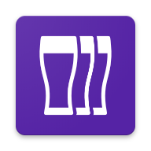

[![My LinkedIn Profile][linkedin-shield]][linkedin-url]
[![My Twitter Account][twitter-shield]][twitter-url]

<!-- PROJECT LOGO -->
 

  

<h1 align="center"><b>beerkip</b>  <small>a React Native & WordPress experiment</small></h1>

This is the <strong>mobile application repo</strong> for a React Native app fully integrated with a WordPress back-end (for user authentication via JWT and data synchronization).
      
    <a href="https://mosaika.fr/appli-mobile-react-native-wordpress/"><strong>Read the tutorial (7 articles in French) »</strong></a>

## About the app
[![Product Name Screen Shot][product-screenshot]](https://media.mosaika.fr/E0uPvnkn)

[**See a quick demo video »**](https://media.mosaika.fr/E0uPvnkn)

This React Native app is a demo concept developed for demonstration purpose. It is made to store a list of favorite beers, create new beers and delete beers and synchronize them with the WordPress database.

To see the WordPress plugin in charge of intercepting AJAX requests and synchronizing data, [visit the `beerkip-wp` repo](https://github.com/psaikali/beerkip-wp/).

### Use the app
1. Download the [Android .apk](https://mosaika.fr/downloads/beerkip-v1.apk) and install the app.
2. You can login by using the `beerkip` login and `beerkip` password to browse, create or edit your own beers.

### Features
* User authentication is done with the help of the [JWT Authentication for WP REST API plugin by Enrique Chavez](https://wordpress.org/plugins/jwt-authentication-for-wp-rest-api/).
* Once logged in, you can access your list of favorites beers.
* You can use a form to create a new beer. 
* Data synchronization (push and pull) is fully integrated with a WordPress back-end (<a href="https://github.com/psaikali/beerkip-wp/">repo is here</a>).

### Installation

This app is using React Native v0.60. To install it and use it locally :

1. Clone this repo.
2. Run `npm install` to install dependencies.
3. Launch your emulator/connect your device and run `react-native run-android`.

_Note: the iOS links have not been set up, you might need to create them properly to make it work on iPhone devices._

### Branches
You'll find a total of (at least) [7 branches](https://github.com/psaikali/beerkip/branches) on this repo, **each branch being related to a specific article tutorial** on my blog.

#### A quick summary of the various things that we will set up :
1. set up screens navigation and basic screens with react-navigation
2. create our Redux store and make it persistent in the smartphone local storage with redux-persist
3. set up basic login and beer creation forms using redux-form
4. add fields validation to these forms
5. create a repeatable field in the beer reation form
6. implement the user authentication logic on the login form, integrated with WordPress
7. synchronize beers data with the WordPress database (sending new data / receiving existing data)

[product-screenshot]: https://mosaika.fr/downloads/beerkip.gif
[linkedin-shield]: https://img.shields.io/badge/-LinkedIn-black.svg?style=flat-square&logo=linkedin&colorB=555
[linkedin-url]: https://www.linkedin.com/in/psaikali/
[twitter-shield]: https://img.shields.io/twitter/url/http/shields.io.svg?style=social
[twitter-url]: https://twitter.com/psaikali
